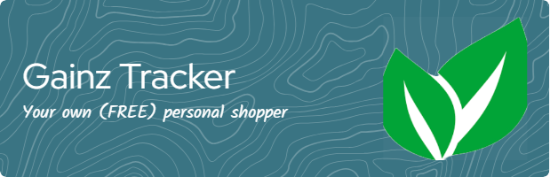

# Gainz Tracker 🏋️

## Overview

**Gainz Tracker** is a full-stack workout and nutrition app aimed at helping users pursue an active lifestyle and meet dietary goals. Initially conceived as a Jiu-Jitsu/Judo technique archive, the project evolved into a personalized nutrition assistant with integrated recipe recommendations, meal planning, and grocery export features.

Although integration with services like Amazon Fresh or Instacart is not yet finalized, the project demonstrates a strong foundation in machine learning, full-stack development, and modern UI design. On the frontend, our application is fully built with Svelte, offering a fast and responsive user experience. We are now focusing on mobile development to bring this experience to iOS and Android users in the near future.

---

## Features

- 🥗 **Recipe Recommendation System** using TF-IDF & Word Embeddings
- 🤖 **AI Chatbot** powered by OpenAI API for nutritional and training advice
- ⌨️ **Autocomplete Engine** based on Princeton’s Ternary Search Trees
- 🔎 **Advanced Search** using Binary Search for fast query resolution
- 🌠 **Animated UI** with background transitions built in Svelte/React
- 📦 **Modular Architecture** with Spring Boot (Java), Flask (Python), and Svelte Frontend

---

## Visuals


---

## Installation

### Requirements

- Java 17
- Node.js
- Python 3.12+
- Docker (optional)
- Spark (for backend vector processing)

### Quickstart

```bash
# Clone repository
git clone https://github.com/yourusername/gainz-tracker

# Run all services with Docker
docker-compose up --build
```

For manual installation instructions for each service, see `/main/backend-spring`, `/main/backend-python`, and `/main/frontend-svelte`.

---

## Usage

Visit `localhost:3000` to open the web interface.  
Search for recipes, get recommendations based on ingredients, or chat with the AI assistant.

Example:

```bash
# Run the recommender manually
cd main/backend-spring
mvn spring-boot:run
```

---

## Roadmap 🚧

- [ ] Integrate Amazon Fresh API or Instacart for delivery
- [ ] Unit tests for the recommender system
- [ ] UI polish and SvelteKit upgrade
- [ ] Add workout tracking and fitness logs

---

## Contributing

We welcome all contributions! 🎉  
Check out [HELP.md](./HELP.md) for contribution guidelines.

Ways to contribute:
- 🐛 Report bugs via [Issues](https://github.com/yourrepo/issues)
- 💡 Suggest features or improvements
- 🧪 Add test cases and documentation
- 🤝 Submit pull requests after testing locally

Run with:
```bash
java --add-opens=java.base/sun.nio.ch=ALL-UNNAMED -jar target/app.jar
```

---

## Project Structure

```bash
.
├── main/
│   ├── backend-spring/     # Java Spring server
│   ├── backend-python/     # Python scrapers and NLP
│   └── frontend-svelte/    # Svelte front-end
├── docker-compose.yml
├── LICENSE
├── README.md
└── k8s-manifest.yaml
```

---

## Algorithms Used

- `TF-IDF + Cosine Similarity`: Initial recommender engine
- `Word2Vec Embeddings`: More scalable recommender fallback
- `Binary Search`: Used in autocomplete
- `Ternary Search Trie`: For efficient prefix matching

---

## Resources & Inspiration

- **Chatbot**: [OpenAI API Docs](https://platform.openai.com/docs/api-reference/introduction)
- **Autocomplete Engine**: [Princeton Course](https://www.cs.princeton.edu/courses/archive/fall23/cos226/assignments/autocomplete/specification.php)
- **Recommender Reference**:
        - [Find Movie Similarity using NLP](https://deepnote.com/app/jayjburgess/Find-Movie-Similarity-from-Plot-Summaries-2407ab30-36ba-4506-a9c8-54ba62fe48d6)
        - [Towards Data Science article](https://towardsdatascience.com/using-nlp-to-find-similar-movies-based-on-plot-summaries-b1481a2ba49b)

---

## Known Issues ❗

- Recommender system lacks formal evaluation metrics
- Word Embeddings are used instead of TF-IDF for memory optimization
- UI currently in transition between frameworks

---

## Authors & Acknowledgements

Thanks to the [OpenAI](https://platform.openai.com/), [Princeton COS226 Team](https://www.cs.princeton.edu/courses/archive/fall23/cos226), and [DeepNote](https://deepnote.com/) for educational resources and API access.

Special thanks to contributors and testers who helped refine the early builds!

---

## License

**Gainz Tracker** is licensed under the [Business Source License 1.1](./LICENSE).  
You may use this project freely for non-commercial purposes.

---

## Project Status

🚧 _Actively maintained but not production-ready. Looking for collaborators._  
_Interested in contributing or maintaining a module? Open an issue or reach out!_

---

Would you like help generating badges (build status, license, version) or visuals (GIF demo or mockups)?